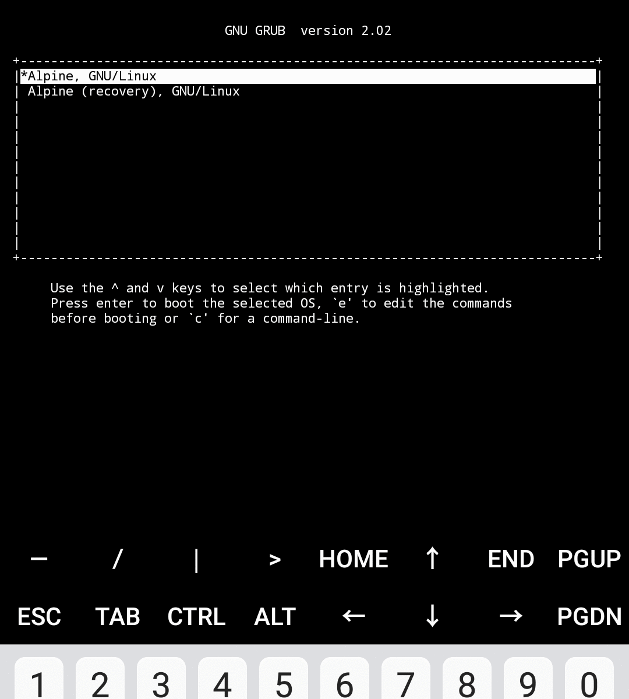

Alpine Term is a terminal and Linux environment application for Android. A key difference of other terminal applications is that it uses Alpine Linux running inside the headless x86_64 machine emulated with QEMU. Interaction with the operating system is done through terminals which are attached to the serial consoles.

Sources are so big so they cannot be uploaded here. Since project is discontinued, I have uploaded it to the [Internet Archive](https://archive.org): https://archive.org/details/android-alpine-term.

